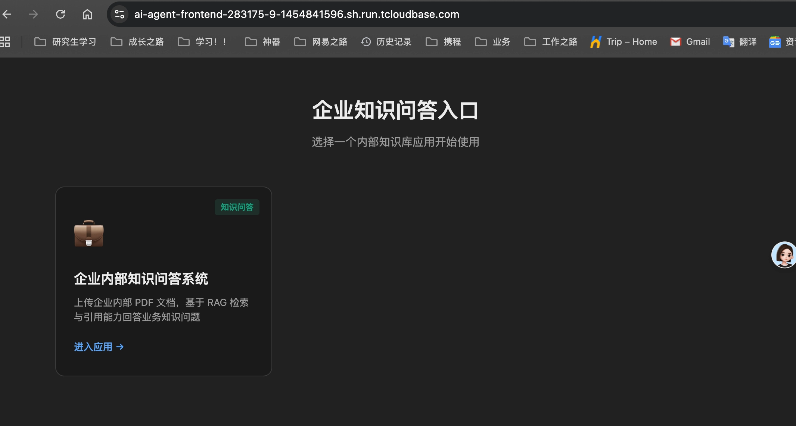
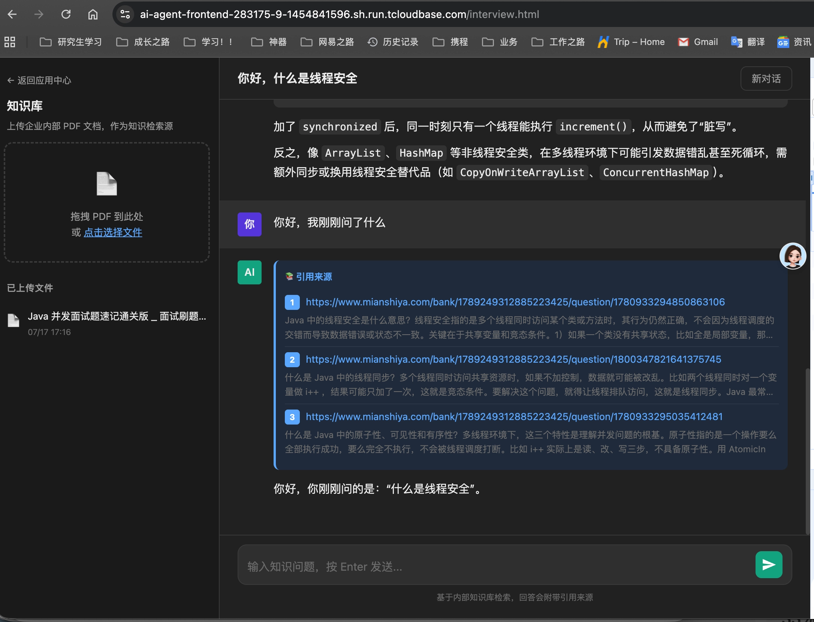

# zhu-ai-agent 后端说明

这是一个基于 Spring Boot 3 + Spring AI 的企业知识问答后端服务，提供 PDF 上传、RAG 检索问答和 SSE 流式聊天能力。
前端项目见：[zhu-ai-agent-frontend](https://github.com/3akiko/zhu-ai-agent-frontend)

> 🚀 阿里云体验地址：http://47.102.142.235/ （前端页面，后端 API 为内网地址，不对外暴露）
> ⚠️ 线上服务可能因云资源欠费或网络波动暂时不可用，可本地运行 或者 docker 部署体验。


## 页面展示




## 主要能力

- **PDF 上传**：支持上传 PDF 文件并建立知识库索引
- **RAG 问答**：基于向量检索与引用结果回答问题，支持引用溯源
- **流式对话**：支持 SSE 流式输出，前端可实时展示回答内容和引用来源
- **健康检查**：提供 `/api/health` 接口用于探活

## 技术栈

- **后端**：Spring Boot 3, Spring AI, PostgreSQL + pgvector, DashScope (通义千问)
- **前端**：Vue 3 + Vite（ AI 生成，`zhu-ai-agent-frontend`）
- **部署**：Docker, 阿里云 SAE + ACR

## 关键目录

- [src/main/java/com/zhubao/zhuaiagent/controller](src/main/java/com/zhubao/zhuaiagent/controller)：接口控制器
- [src/main/resources](src/main/resources)：配置文件与环境变量模板
- [docker-compose.yml](docker-compose.yml)：Docker Compose 启动配置

## 本地运行

### 后端
```bash
./mvnw spring-boot:run
```

服务启动后默认监听：
- http://localhost:8123/api

### 前端（需单独启动）
```bash
cd ../zhu-ai-agent-frontend
npm install
npm run dev
```

前端开发服务器默认监听 http://localhost:5173，需配置代理到后端 8123 端口。

## 常用接口示例

| 方法 | 路径 | 说明 |
|------|------|------|
| POST | `/api/upload/add` | 上传 PDF 文件 |
| POST | `/api/chat/rag/stream` | 流式 RAG 问答（SSE） |
| GET | `/api/health` | 健康检查 |

## 配置说明

后端配置主要在 src/main/resources/application.yml 中：
- `server.port=8123`
- `server.servlet.context-path=/api`
- `spring.ai.*`：模型与向量检索相关配置
- `spring.servlet.multipart.*`：上传文件大小限制

运行前需要准备以下环境变量：

| 变量 | 说明 | 必填 |
|------|------|------|
| `DASHSCOPE_API_KEY` | 阿里云通义千问 API Key | 是 |
| `SPRING_PROFILES_ACTIVE` | 激活配置（local/docker） | 否，默认 local |

## 构建与打包

```bash
./mvnw clean package
```

## Docker 部署

```bash
docker compose up --build
```

默认会启动后端容器和前端容器，端口映射如下：
- 后端：8123
- 前端：8080

## PDF文件上传
这里以面试题作为模拟资料，内包含面试题及对应网站；
- [file/pdf](file/pdf)

## 常见问题
### Q: 镜像拉取失败 `no match for platform`
**原因**：本地 Mac（Apple Silicon）构建默认输出 `linux/arm64` 架构，而 SAE 节点为 `linux/amd64`。
**解决**：`docker build` 时添加 `--platform=linux/amd64` 参数。

### Q: Docker Hub 拉取镜像超时
**原因**：国内网络访问 Docker Hub 不稳定。
**解决**：建议使用阿里云 ACR 作为镜像仓库，同账号 SAE 可免密拉取。

### Q: SAE 部署后调用 DashScope 超时
**原因**：SAE 实例在 VPC 内，默认无公网出网能力。
**解决**：为 VPC 配置 NAT 网关并添加 SNAT 规则。

## License

MIT